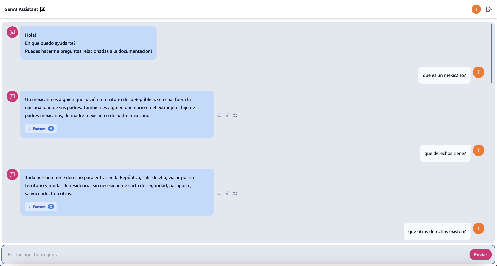

# Introduction

This repository contains a sample web application for the RAG based Q&A chatbot. It uses Vite + ReactJS. To deploy it you will create an Amazon CodeCommit repository and configure an AWS Amplify frontend application.

## Pre requisites

- NodeJS
- Install the RAG based Q&A backend

## Deployment

Create a CodeCommit repository to store the frontend code, name it as you desire and take note of the name. You can create a repository using the following command

`aws codecommit create-repository --repository-name <REPO_NAME> 
--repository-description <REPO_DESC>`

Execute the following command to create an AWS Amplify CI/CD pipeline to deploy the web application. This pipeline will be triggered every time you push changes to the CodeCommit repo.

```
aws cloudformation deploy --stack-name webapp --template-file template.yaml --capabilities CAPABILITY_IAM --parameter-overrides file://parameters.json
```

the *parameters.json* file contains the values of the required stack deploy parameters. A *parameters.json* file template is provided and you can consult the required backend parameter values at the CloudFormation console.

Next, push the current version of this code to your newly created CodeCommit repo, use the following commands:


`git config --local init.defaultBranch main`

`git init`

`git add .`

`git commit -m "Initial commit"`

`git push <\%\%URL_OF_CODECOMMIT_FRONTEND_REPO\%\%> --all`

From now on every-time you push new changes to your frontend repo a new version of it will be automatically deployed.

## Use of the UI

By default, AWS Amplify will create a domain for your web application. Navigate to the Amplify console, look for your web application and click on it. Under the *hosting environments* tab you will find your web app deployment and a URL you can follow to navigate to your web applications main page.

The sample UI is a simple conversational interface and will look like the one bellow.



Just type your questions in the prompt and wait for the results to come.
